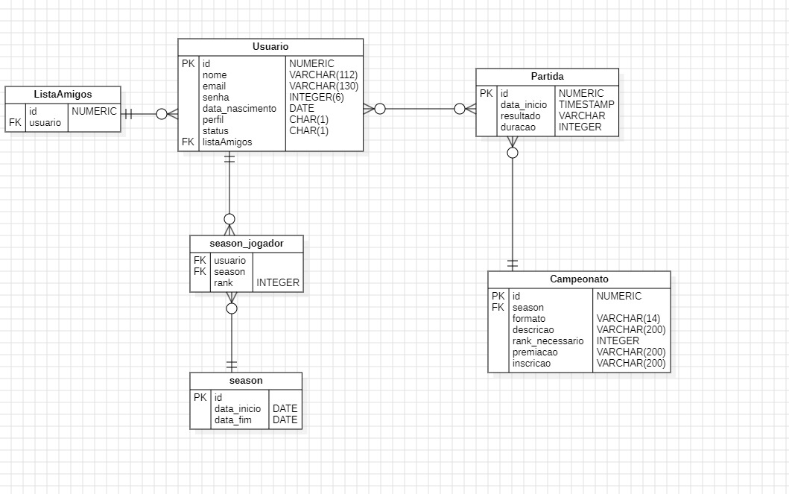

# Web and Mobile Programming

## 📖 Trucado: A Full-Stack Card Game Project

This project was developed in the classroom during "Web and Mobile Programming" subject in my second year of ungraduate studies at University of Passo Fundo.

Trucado is a digital version of the popular Latin American card game "Truco," widely enjoyed in countries like Brazil, Uruguay, and Argentina. It was developed using the PERN stack:

- PostgreSQL: For managing the relational database.
- Express.js: A flexible backend framework for building RESTful APIs
- React: The web application frontend, providing dynamic and responsive user interfaces.
- React Native: For the mobile application.
- Node.js/TypeScript: For backend services and overall server logic.

## Backend (API)

The backend is built with Express.js and serves as the core of the application, handling:

- User Management: Authentication, authorization, friend list, game status, ranking by season
- Tournaments;
- Matches;
- Teams;

#### Scratch UML

    

## Frontend

The frontend is built with React library and Next.js as framework.

## Mobile

## Installation and Setup

NPM Dev Parameters:

- TypeORM: `npx typeorm init --database postgres`
- Typescript: `npm install -D typescript`
- TS-Node: `npm install -D ts-node`
- Nodemon: `npm install -D nodemon`
- @types/express: `npm install -D @types/express`
- @types/cors: `npm install -D @types/cors`
- @types/bcryptjs: `npm install @types/bcryptjs --save-dev`

NPM Parameters:

- Express: `npm install express`
- Cors: `npm install cors`
- Env: `npm install dotenv`
- Pg (postgres library): `npm install pg`
- At tsconfig.json, add: `"esModuleInterop": true`
- JWT: `npm install jsonwebtoken`
- @types/jsonwebtoken: `npm install @types/jsonwebtoken`
- BcryptJS (password hashing): `npm install bcryptjs`
- Faker: `npm install @faker-js/faker`

FrontEnd

- Next.js : `npm install -g nextjs`
- React/Next files: `npx create-next-app@latest`
- Axios: `npm install axios`

Mobile

- AVD (Android Studio / SDK 34)
- Habilitar mod dev e conectar o cel
- npm install -g expo-cli
- npx create-expo-app --template blank nome
- npx expo start
